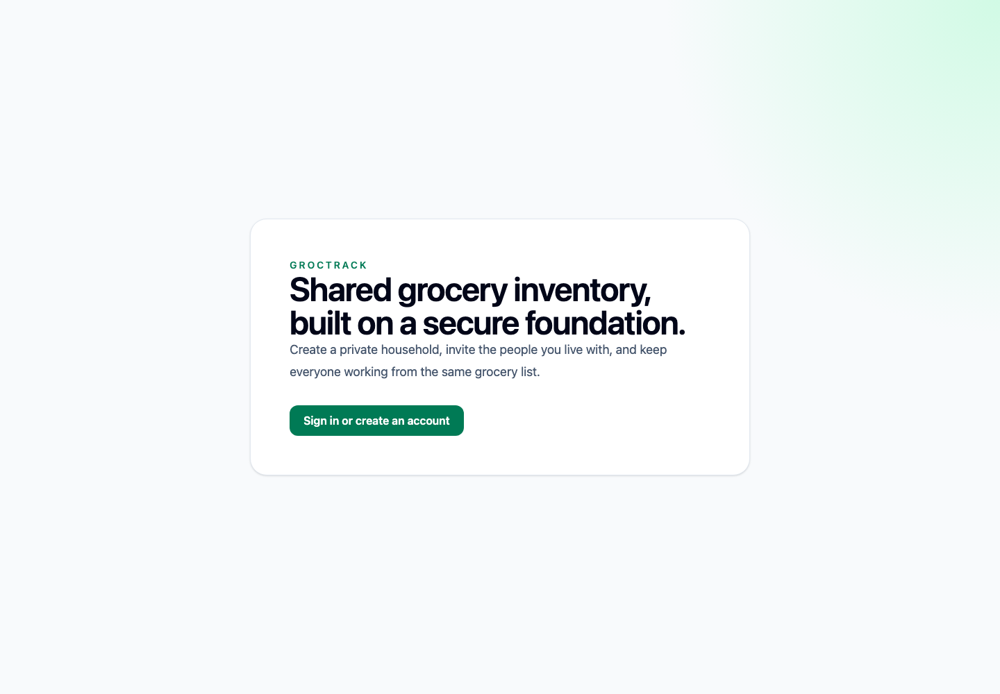
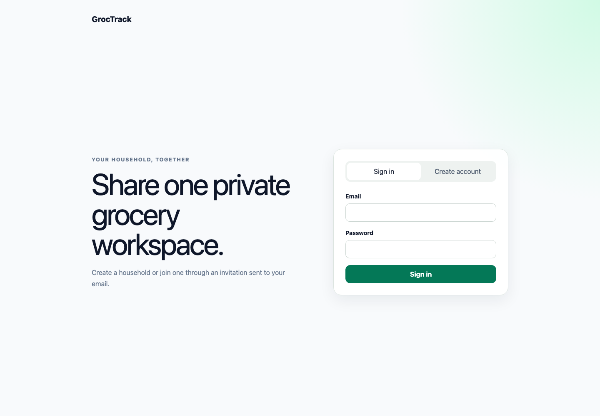
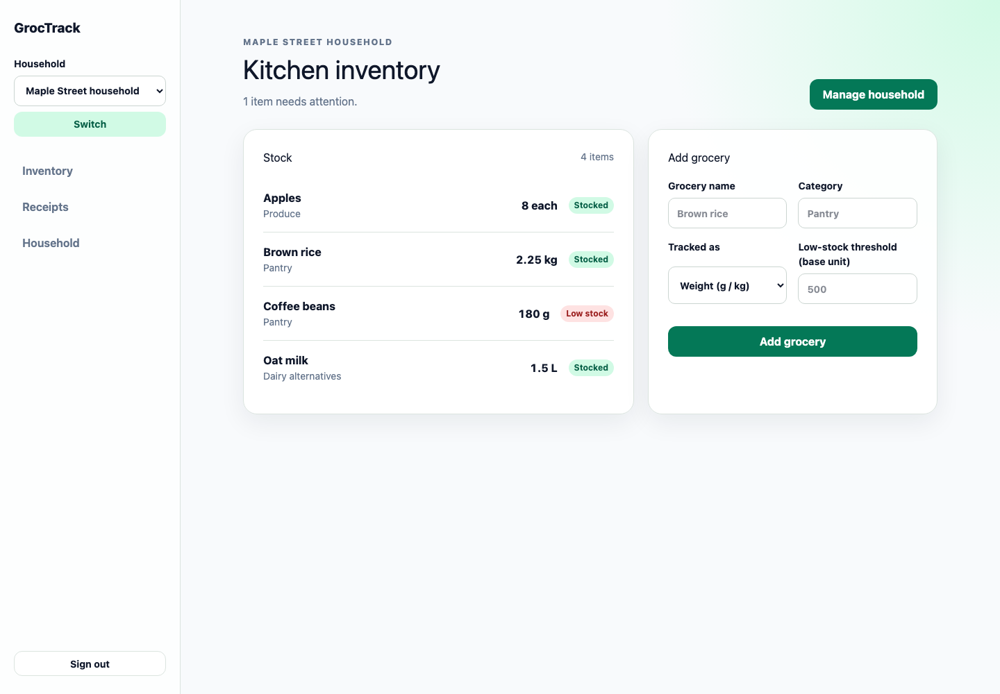
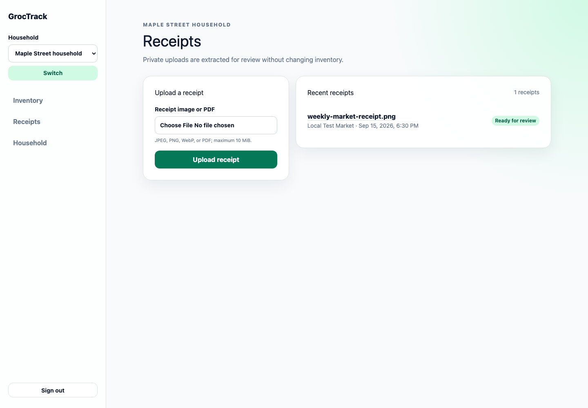

# GrocTrack

GrocTrack is a private, shared grocery inventory for households. It keeps stock
levels, receipt uploads, and household access in one responsive Next.js app
backed by a tenant-isolated Supabase data model.

- Track grocery quantities across weight, volume, and count units with low-stock
  indicators and an auditable inventory history.
- Upload receipt images or PDFs for deterministic extraction and review before
  they affect inventory.
- Create private households, invite members by email, and keep every household's
  data isolated with PostgreSQL row-level security.

## Visual tour

### Welcome and authentication





### Household inventory



### Receipt review



## Prerequisites

- Node.js 22.13 or newer
- npm
- Docker Desktop or another Docker-compatible runtime
- Supabase CLI

## Local setup

1. Install dependencies:

   ```bash
   npm install
   ```

2. Start Supabase and copy its local API URL and anon key:

   ```bash
   npx supabase start
   ```

3. Copy `.env.example` to `.env.local` and replace the placeholder anon key
   with the value printed by Supabase. Keep `SUPABASE_SERVICE_ROLE_KEY`
   server-only; never expose it through a `NEXT_PUBLIC_` variable. Receipt
   extraction defaults to the deterministic `fake` adapter outside production.
   For Gemini, set `RECEIPT_EXTRACTOR=gemini`, `GEMINI_API_KEY`, and optionally
   `GEMINI_RECEIPT_MODEL`.

4. Apply the database migration:

   ```bash
   npx supabase db reset
   ```

5. In the local Supabase dashboard, keep email authentication enabled. For
   production, add the deployed `/auth/callback` URL to the allowed redirect
   URLs.

6. Start the app:

   ```bash
   npm run dev
   ```

Open [http://localhost:3000](http://localhost:3000).

## Storybook

Storybook uses the official Next.js Vite framework and imports the production
global styles. Stories render typed presentational screen components and
production form components without connecting to Supabase or Gemini.

```bash
# Interactive component development at http://localhost:6006
npm run storybook

# Deterministic static build
npm run build-storybook

# Headless Chromium interaction and accessibility checks
npx playwright install chromium
npm run test-storybook
```

Accessibility violations fail story tests. Story interaction tests use only
local deterministic data. Update a story by changing its fixture data or play
function; there are no image snapshots or external baselines to update.

## Playwright end-to-end tests

Playwright requires Docker, the Supabase CLI, `jq`, and Chromium:

```bash
npx playwright install chromium
npm run test:e2e
```

`test:e2e` starts Supabase when necessary, resets it from migrations, exports
the local API/anon/service-role values for the test process, forces
`RECEIPT_EXTRACTOR=fake`, starts Next.js at `http://localhost:3000`, and stops Supabase only when the script
started it. When reusing a running stack, it resets the database again after the
suite so test users, households, inventory, and receipt objects cannot leak.
Set `E2E_SKIP_DB_RESET=1` only to skip the initial reset while debugging; final
cleanup still runs. Set `PLAYWRIGHT_BASE_URL` to use a different local app URL. Never point
these tests at a hosted Supabase project.

Each test creates confirmed local users with unique emails and removes them
afterward. Household, inventory, operation, and receipt identifiers are unique
per test. Browser traces, screenshots, and videos are retained only for failed
tests and written under ignored `test-results/` and `playwright-report/`
directories.

The runner checks the Docker database clock before resetting data. If Docker
Desktop has drifted by more than 30 seconds, restart Docker Desktop; Supabase
correctly rejects sessions whose JWT appears to have been issued in the future.

```bash
npm run test:e2e:ui
npm run test:e2e:debug
npm run capture:screenshots
npx playwright show-report
```

The desktop project runs the complete journey suite. The mobile Chromium
project runs tagged responsive route and accessibility coverage. Receipt tests
generate JPEG, PNG, WebP, and PDF inputs in memory and use the deterministic
fake extractor; no Gemini credentials or network calls are used. The screenshot
command uses the same isolated local stack and writes the curated 1440×1000 PNG
assets under `docs/images/`.

## Validation

```bash
npm run lint
npm run typecheck
npm test
npm run build
npm run build-storybook
npm run test-storybook
npm run test:e2e
npm audit --omit=dev --audit-level=high
npx supabase start
./scripts/test-inventory-upgrade.sh
npx supabase db reset
npx supabase db lint
npx supabase test db
npx --package supabase@2.117.0 -c 'bash supabase/tests/integration.sh'
./scripts/test-inventory-concurrency.sh
npm run test:receipt-upgrade
npm run test:receipt-integration
npx supabase stop --no-backup
```

The lower-layer integration script requires a running local Supabase stack and
Docker. It exercises the Storage/Auth APIs and two-connection foundation races.
The inventory upgrade test stages the initial migration, seeds a representative
ledger and projected balance, applies the inventory migration, and verifies data,
triggers, RPC permissions, and precision-safe views. The concurrency test uses
two database sessions to prove operation UUID replay applies one ledger row and
one balance change, then holds the item advisory lock while invalid quantities
are rejected before waiting.
The same checks run in GitHub Actions for pull requests and pushes to `main`.

The database tests exercise cross-household RLS, owner-only invitations,
email-bound invitation acceptance, profile visibility between members, exact
unit conversion, append-only inventory transactions, transactional balance
projection, idempotent manual changes, and duplicate purchase/reversal
protection. Receipt tests cover media validation, structured extraction,
reconciliation warnings, duplicate-work claims, and service-role-only
persistence. Database CI also exercises a populated `002` to `003` migration
upgrade and live Storage/RLS concurrency, signed-URL, and membership-revocation
boundaries.

The `receipts` storage bucket is private. Object names must begin with the
household and uploader UUIDs, for example
`<household-id>/<uploader-id>/<upload-id>.jpg`; storage policies bind both path
segments to active membership and object ownership. Receipt viewing uses
authorized, short-lived signed URLs. Email confirmation is enabled locally and
must remain required in production so invitation acceptance proves control of
the invited mailbox.

Receipt images are fully decoded with patched `sharp`/libvips under a
25-megapixel, 12,000-pixel-edge, single-frame limit; container lengths and
trailing data are also checked. PDFs are structurally parsed with `pdf-lib`,
must end at `%%EOF`, and are limited to 50 pages and the common 10 MiB upload
bound. PDF embedded streams are not rendered server-side, avoiding unbounded
rasterization while the byte and page caps bound parser exposure. Extracted
money and quantity evidence remains validated decimal text until PostgreSQL
casts it to exact `numeric` columns.

Upload object names are deterministic for each client operation. If receipt
registration fails, the private object is retained rather than synchronously
deleted; a retry verifies ownership, size, and SHA-256 before reusing it. This
avoids deleting an object that a concurrent successful request is about to
reference. Any future orphan cleanup must be delayed and use the Storage API,
never direct `storage.objects` metadata deletion.
